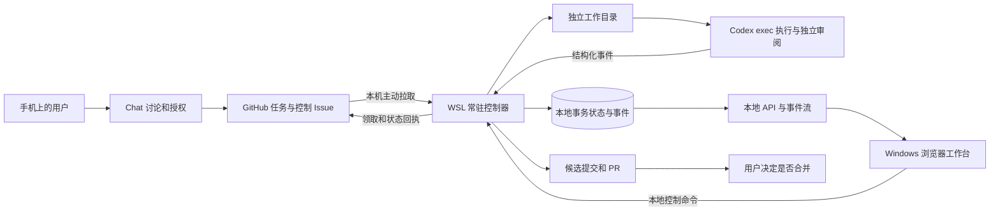

> 完整 V2 未来设计，尚未全部实现。当前可用范围以 [MVP-1](V2-MVP1.md)和[真实工作台](MVP1-WORKBENCH.md)为准。

# V2 远程指挥与本机工作台设计

本设计面向一个明确的工作方式：用户在手机上与 Chat 讨论并授权任务，Chat 把完整指令写入 GitHub Issue，家中电脑上的 Codex 执行；用户回来后，在 Windows 浏览器中看到执行经过、修改、检查和待处理结果。

**采用 GitHub 作为远程指令与回执通道，本机常驻控制器负责执行和持久化，React 工作台负责观察与本地控制。** 第一版是单人、单主机、多仓库、串行执行；执行环境为 WSL2 / Ubuntu。V1 的程序、安装目录、配置、队列和证据保持独立。

这是待实现的实施设计，不是已经上线的能力声明。设计依据为 `integration/maintenance-20261002` 的 `f167f4178baf5b33c31dca4fea6e4157aa893426`，核对日期为 2026 年 10 月 3 日。用户已确认上述使用范围。协议和故障规则见 [V2协议与恢复](V2协议与恢复.md)，开发顺序及验收见 [V2实施验收](V2实施验收.md)。

当前界面见[真实工作台说明](MVP1-WORKBENCH.md)。已被替代的独立 HTML 演示可从 Git 历史查阅。

## 1. 用户实际会怎样使用

### 离开电脑前

打开“启用远程工作”，完成一次环境检查：主机在线、GitHub 可访问、Codex 已登录、登记仓库及固定检查可用、工作目录无冲突。页面展示最后一次真实检查时间。关闭浏览器和普通终端后，控制器继续运行。

电脑须保持开机、联网，WSL 实例须持续运行。休眠、关机或失去网络时，GitHub 仍可接收指令，但本机无法立即执行。开启远程工作不等于修改 Windows 电源策略；页面明确显示运行前提。

### 用手机派任务

用户对 Chat 说需求。Chat 读取目标仓库当前代码、项目规则和本机导出的能力摘要，把需求整理成可独立验收的任务。用户已有明确执行授权时直接发布；尚在讨论时保留草稿。用户无需手写协议 JSON。

Chat 返回真实 Issue 链接，并区分“GitHub 已保存”和“主机已领取”。后续用户在同一或新的 Chat 中说“看看进度”，Chat 读取主机回执和 PR。关闭手机、离开聊天不会中断已领取任务。普通 Chat 不保证自动收到完成通知；可使用 GitHub 自身的订阅通知，具体推送取决于用户设置。

### 回到电脑

工作台首页直接回答四个问题：

1. 主机能否接收下一条指令？
2. 当前任务在做什么，最后一次活动是什么？
3. 离开期间完成了哪些修改和检查？
4. 现在有哪些事情需要用户决定？

点击任务即可看时间线、文件变化、检查结果和 PR。任务已经结束也能回看过程。浏览器只是查看入口，不承担任务存活责任。

## 2. 第一版边界

| 做到 | 后续独立阶段 |
| --- | --- |
| 一个 Owner，一个 WSL 执行主机，多个登记仓库 | 多人权限、多个 Host 争抢任务 |
| 手机 Chat → GitHub Issue → 本地 Codex → 检查/审阅 → PR | 手机上直接访问本地工作台、公网登录/OAuth |
| 执行过程、命令摘要、文件变化、检查和异常可回看 | 在网页中接管任意现有 PowerShell/Codex 会话 |
| 暂停领取、恢复领取、取消指定任务、查看状态、设置默认模型 | 向正在执行的 Codex 随时插话、远程批准任意 shell 命令 |
| 网络故障恢复、回执补发、发布结果核对 | 自动合并、自动部署、跨电脑执行接力 |
| 本地真实数据模式；独立的 Mock 与 local-smoke 模式 | DeepSeek 生成后端及通用供应商平台 |

第一版的“Chat”是用户已有的手机/网页 Chat。工作台无需再造一个完整聊天产品。需求扩大或需要补充输入时，由 Chat 整理新的授权任务，关联旧任务与保留证据；普通讨论评论不会悄悄改变正在执行的合同。

手机上的 Chat 必须实际具备创建普通 Issue、评论和回读能力。桌面已连接 GitHub 不代表手机拥有同样的写工具；在开发开始时先用不触发执行的 Issue 做连接验收。写能力未核实前，不把“复制文本到 GitHub”冒称为自动派单。

## 3. 系统结构和职责

| 部分 | 唯一职责 |
| --- | --- |
| Chat | 需求、范围、验收、正式发布；不假定本机在线，不猜环境能力 |
| GitHub | 跨网络保留授权、简明回执和候选 PR；不是实时日志数据库 |
| Controller | 校验授权、排队、模型/配置冻结、状态转换与恢复决策 |
| Runner | 管理本次执行的进程、输出、时间预算和清理；不自行读取新 Issue |
| Publisher | 推送已固定的候选，幂等核对 PR 和回执；不调用模型修复发布失败 |
| Store | 原子保存命令、任务状态、事件和待投递记录 |
| Local API | 经相同控制入口接收本地命令，提供脱敏投影和可续传事件 |
| React | 表单草稿、导航、展示；不拥有任务状态、不直接写 runtime |

采用一个常驻控制器和一个写入入口。GitHub 拉取、回执投递、本地 API、进程监督必须并行推进，但只允许一个有副作用的任务执行槽。网络请求和模型进程不能占着数据库事务或全局业务锁等待。

本地紧急取消通过已经认证的本地 API 进入同一个控制服务，不依赖 GitHub 联网，也不伪造 GitHub Issue 身份。远程取消依赖 GitHub 可达性，界面必须显示“取消请求已保存 / 主机已收到 / 进程已停止”这三个不同阶段。

## 4. 连接方式的决定

### 远程采用主动轮询

WSL 主机主动使用 GitHub HTTPS API 读取登记仓库。无需公网 IP、端口映射、家用路由器配置或云端中转服务。暂不引入 Webhook 接收端。

设计默认每仓库约 60 秒检查一次，错开时间，遵守服务端更长的轮询/限流要求；这是目标配置，不是远程响应 SLA。分页、增量游标和周期性全量核对共同避免漏任务。只有收到主机的持久化回执，才显示“已领取”。

GitHub 官方建议可用时优先使用 Webhook，也提供不得不用轮询时的条件请求和限流规则。本方案因单机跨网络、避免入站服务而选择轮询，并按 ETag、分页、退避实施。[GitHub REST 最佳实践](https://docs.github.com/en/rest/using-the-rest-api/best-practices-for-using-the-rest-api)

### Codex 采用受监督的非交互执行

第一条生产路径继续使用 `codex exec --json`，不解析终端颜色或屏幕，不控制 PowerShell 窗口。官方提供结构化事件、最终输出文件和指定会话恢复能力；这些足以支撑任务过程展示。CLI 版本必须固定并经兼容性验收，参数以该版本的帮助及实际探测为准。[非交互执行](https://learn.chatgpt.com/docs/non-interactive-mode)

App Server 更适合深度交互客户端。考虑当前需求及其文档中的实验性限制，本版不把它作为必要依赖；将来需要实时追问、审批交互时再增加适配器，复用同一任务/事件模型。[App Server](https://learn.chatgpt.com/docs/app-server)

### 本地采用 HTTP 加 SSE

API 只监听 loopback，Windows 浏览器通过本机地址访问；事件使用 SSE，查询与操作使用普通 HTTP。进程运行与浏览器连接互不依赖。保留现有 `ChatCodexClient` 和 `useWorkspace` 入口，并扩展历史分页、事件续传和取消动作。

所有业务事实以服务端为准。连接失败保留最后一次快照及其时间，禁用不安全操作；不得自动切换 Mock，也不得把尚未收到回执的命令显示为成功。

## 5. V1 与 V2 的隔离

V1 继续位于 `codex-github-local/`，其 `0.1.0` launcher、profile、runtime、验证夹具保持原样。V2 使用独立安装、状态目录、工作目录和任务分支。

**V2 正式协议改用 `[codex-v2] ` 与 `/codex-v2 run`；控制入口使用 `[codex-v2-control] ` 与 `/codex-v2 control`。** 现有原型中的旧前缀停止作为生产入口，迁移必须显式核对，不能扫描历史 Issue 后自动执行。

“并存安装”不代表同时操纵同一仓库。登记时明确一个仓库由哪个版本负责；V2 激活真实任务前检查 V1 当前任务及待审 PR，停止 V1 watcher 后再启用 V2。由于 V1 不参与新的主机锁，V2 不能声称仅靠自己的锁即可阻止 V1 或用户手工启动的 CLI；启用检查和运行说明必须明示这一限制。

V2 的回退方式是停止并保留自身状态，重新启用独立的 V1。不得把 V2 数据库交给 V1 读取，也不把未决 V2 候选当成 V1 的已接纳结果。

## 6. 状态存储与任务执行

正式 V2 增加一个本地 SQLite 状态库，统一保存命令去重、任务阶段、模型快照、事件游标和待投递项。选择它的原因是“状态改变 + 审计事件 + 回执待投递”需要在同一事务中提交；现有多个 JSON 文件的原子替换不能提供跨文件事务。

SQLite 放在 WSL 本地 Linux 文件系统，使用一个写入者、WAL 和明确的持久化配置；不放到网络盘或作为跨主机锁。大日志、补丁和报告仍保留为文件，以哈希和清单引用。JSON 快照是可导出的证据，不再成为另一份可写权威状态。

这属于 V2 原型到正式执行版本的数据迁移，不修改 V1。迁移须停止旧 V2 watcher、验证旧 schema、保存原字节备份、导入到新库并核对计数与防重放标识，再切换；失败保持原数据。现有 schema 1 → 2 迁移规则继续适用，不能凭当前模型设置补造旧回执。

任务领取时在一个事务里冻结：原授权及来源、仓库/基线、允许范围、本地策略哈希、检查定义、执行者与审阅者模型、预算。配置变化只影响未来任务；禁止正在执行时扩大权限。任务的 `runtime-default` 必须解析成可审计的具体配置；实际模型信息不能确认时标记未知，不能冒称已固定。

每个任务使用独立 Git worktree；高隔离需求使用独立克隆或容器，以免 worktree 共用 Git 元数据造成越界影响。执行者只处理工作区，候选 commit、push、PR 由可信控制器生成和发布。固定检查使用本机登记的参数数组，不从 Issue 接受任意 shell 字符串。

全主机只运行一个执行/检查/审阅阶段。同一仓库的候选等待人工审阅时，不启动该仓库下一项写任务；其他仓库可以继续，避免一个待审 PR 阻塞全部工作。调度按仓库轮转，各仓库内部按已验证的接收次序处理。

## 7. 稳定性原则

1. **有记录才算领取。** 先保存冻结任务，再启动进程；GitHub 回执丢失不导致再次执行。
2. **不承诺跨系统严格 exactly-once。** 对可重复的通信做去重；对无法确定结果的进程启动和外部副作用停下来核对。
3. **执行和发布分开恢复。** 已生成候选后断网，只恢复推送/PR/回执，不重跑模型。
4. **控制通道不能被执行占住。** 长任务期间照常读取控制命令；旧回执投递失败不阻塞取消或暂停。
5. **中断不自动重放。** 崩溃或重启时保留工作区和日志；没有足够证据证明安全续行时，进入“需要处理”。
6. **成功必须有证据。** 正确退出、完整终态、结果格式、范围检查、固定检查和独立审阅分别记录。
7. **状态必须有时间。** 主机在线、GitHub 可达、Codex 可用和当前任务活跃度分别显示；历史心跳不能伪装成实时在线。

暂停只影响新任务领取，不杀当前进程。取消会请求停止目标任务，直到进程组清理完成才报告“已取消”。如果取消发生在远程 PR 写入结果未知时，先核对已存在的候选/PR，再报告真实结果；不能承诺撤回已经发生的外部操作。

## 8. 工作台的信息结构

### 概览

首页上方是一条紧凑的连接状态栏：WSL 控制器、GitHub 最近同步、Codex 可用性、队列开关。主区域优先显示当前任务与最新活动，下面是“需要你处理”和“离开期间完成”。不以大量模型数量、成功率或装饰性指标占据首页。

主机失联时显示最后观测时间；空闲时显示“等待 GitHub 指令”；有任务时显示真实阶段和最后输出时间。没有依据时不显示完成百分比或预计完成时间。

### 任务工作区

| 区域 | 内容 |
| --- | --- |
| 左侧导航 | 概览、任务、主机、模型与设置；PR 与证据进入对应任务查看 |
| 任务头部 | 用户目标、仓库、Issue、当前阶段、运行时间、来源、待办动作 |
| 中央过程 | 领取 → 准备 → 执行 → 检查 → 审阅 → 发布；活动按时间串联 |
| 右侧结果 | 已改文件、检查结论、审阅意见、候选提交、PR、未验证项 |
| 次级详情 | 冻结合同、模型设置、预算、诊断日志、完整证据 |

过程不是不断滚动的原始终端：公开的助手说明、命令开始/结束、文件修改、检查和异常按事件卡片展示；重复工具输出折叠，点击查看经过限制和脱敏的详情。只展示 CLI 实际提供的公开过程，不承诺模型内部思考的完整可视化。

“全部活动 / 文件变化 / 检查结果”是同一任务的不同视图，不建立三套业务状态。页面刷新或稍后回来，能够从持久化事件重建同一过程。

### 操作和文案

| 用户操作 | 页面如何反馈 |
| --- | --- |
| 暂停领取 | “已暂停领取；当前任务继续” |
| 取消任务 | 先“请求停止”，清理完成后“已取消，现场已保留” |
| 设置默认模型 | 显示待确认，探测与服务端应用成功后更新；当前任务模型保持冻结 |
| 网络断开 | “连接中断，当前显示截至某时的数据”；不把主机推断为关机 |
| 检查不可用 | 明确缺了哪项；若合同允许则 Draft PR，并保留“需人工验证”标记 |
| 需要补充需求 | 给出具体问题与可复制的交接摘要，回到 Chat 新建修订任务 |
| PR 已合并 | 先“远端已合并”；候选祖先关系和本地同步确认后才是“已接纳” |

### 视觉方向与 DSH 的借鉴

延续现有 React、TypeScript、Vite 前端。采用安静的侧栏、明确的主内容、低饱和蓝色强调、紧凑状态标签、易读时间线、亮/暗主题和键盘可访问控件。任务过程占据主要视觉空间，终端输出作为可展开证据。

借鉴 DSH 的服务端权威状态、客户端投影、连接恢复和会话轨迹呈现思想，继续保留现有基础控件的来源与许可。这里只需要一个 typed client 和一个页面级状态入口；不引入 Cordis 插件运行时、动态 Slots 体系或 DSH 后端。参照固定源码的 [Web Client 架构](https://github.com/deepseek-ai/deepseek-harness/blob/639ed015397290b3745d163aafe02ffee4aa3f84/docs/subsystems/web-client.md)。

TISU 图书馆继续作为独立视觉组件，可保留在欢迎页或空闲页。首次连接后直接进入工作台；运行任务时不占据主要区域。真实本地模式的入口名称是“连接本机”，不把当前演示登录页称作已实现的账号系统。

## 9. 本地访问与常驻运行

服务端校验 Host、Origin 和本地会话；首次打开使用短时一次性本机启动凭据换取 HttpOnly、SameSite 会话，随后清除 URL 中的一次性信息。写请求增加 CSRF 校验，禁止跨域。GitHub token、Codex 登录信息和配置文件都不进入浏览器。浏览器只能按证据 ID 读取允许公开的投影，不能传任意磁盘路径。

WSL 内使用受监督的服务管理 daemon 和所属进程。Windows 侧提供隐藏的启动/驻留入口，由持有该 WSL 发行版的 Windows 用户运行；它维持前台 WSL 调用并检查服务可达性，不成为第二个任务控制器。登录自启动可在安装阶段选择，必须用真实机器验证。

不能把“配置了 systemd”当作“电脑始终在线”。微软明确说明 systemd 服务本身不会保证 WSL 实例存活；本地网络转发也受机器配置影响。[WSL systemd](https://learn.microsoft.com/en-us/windows/wsl/systemd)、[Windows 访问 WSL 网络服务](https://learn.microsoft.com/en-us/windows/wsl/networking)

首次发布前必须现场验证：关闭所有终端、浏览器退出、Windows 锁屏、WSL 重启、睡眠恢复、代理失效。重启可恢复接单服务，但不能自动重放中断任务。关机、睡眠期间仍无法执行；没有外部在线主机时，本设计不会自动唤醒家中电脑。

## 10. 源码边界与需要补齐的部分

| 当前代码 | 接续方式 |
| --- | --- |
| `contract.py / policy.py / state.py` | 保留合同和策略意图，补严格字段校验、等待/中断/恢复状态 |
| `github_protocol.py / gh_cli.py` | 增加 V2 独立命名空间、来源 ID、分页和授权冻结；不另造平行协议解析器 |
| `control.py / claim.py` | 保留动作语义和模型冻结，迁入同一事务状态库 |
| `controller.py` | 保留确定性状态转换，把进程及网络等待交给监督与适配器 |
| `codex_adapter.py` | 补真实执行/审阅和精确事件分类；模型供应商细节不流入页面 |
| `git_workspace.py / evidence.py` | 保留隔离与证据能力，补候选固定、元数据保护、恢复核对 |
| `harness.py` | 继续做隔离测试夹具；生产本地 API 不沿用 synthetic GitHub 身份 |
| `web/app` | 唯一活跃前端；增加过程、历史、取消、连接状态和真实 API 数据 |

新增模块仅对应真实边界：事务存储、daemon/进程监督、任务执行、GitHub 发布、本地 API。能在现有文件里清晰表达的逻辑不再包装 service → manager → facade 多层转发。

阅读基线时发现两个必须纳入验收的具体点：`classify_jsonl_line()` 目前按名称含 `completed` 判断终态，会把工具项结束与整个执行结束混在一起；`CodexProbeRunner` 在临时非 Git 目录执行，需要明确准备独立 Git 环境或使用经过验证的对应选项。这是代码阅读结论，不是本轮完成修复或真实模型测试的声明。

## 11. 完成标准

设计的第一版交付终点是一条真实、可恢复、可回看的闭环：

**手机 Chat 发布一个小任务 → 已登记 WSL 主机领取一次 → Codex 完成受限修改 → 固定检查和独立审阅 → PR → 本地页面回看过程 → 用户合并 → 本机核对接纳。**

在此之前，需要通过协议隔离、重复投递、断网、进程清理、发布响应丢失、重启恢复、跨仓库同号任务、日志脱敏和浏览器重连验收。完成 UI、Mock 演示或离线测试，均不能替代这条现场闭环。
